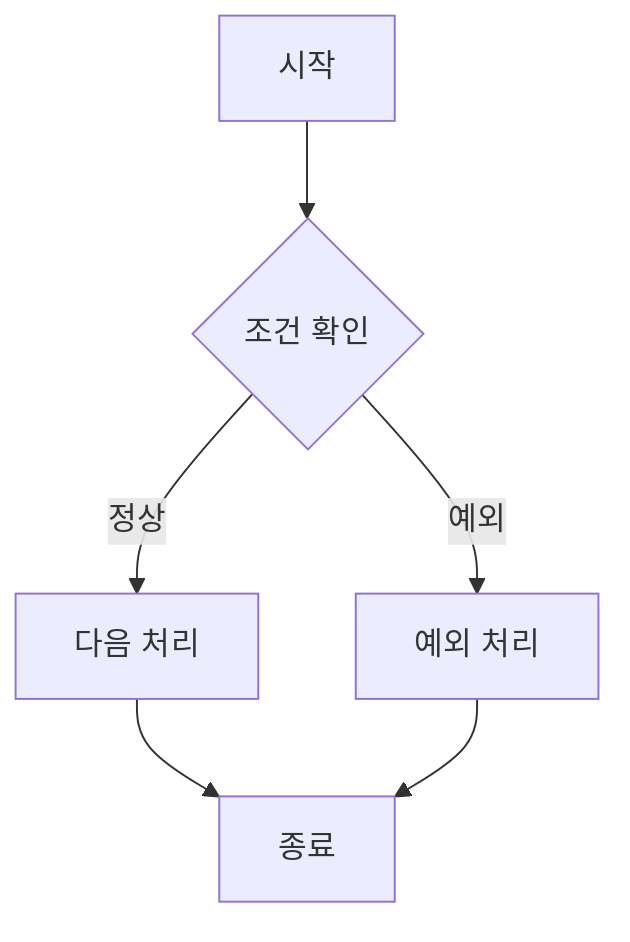

# AX 평가 시스템 분석·설계 산출물 템플릿 통합 가이드
## 요구사항 → ERD → 프로그램 → 시나리오 → UI 목업 → GitHub Issue → 개발 → 테스트까지 한 번에 따라가는 전체 안내서

> **프로젝트:** AX 평가 시스템 2차 프로젝트  
> **대상:** 시스템 분석·설계 경험이 거의 없는 초보 개발자  
> **기술 방향:** Django + PostgreSQL + Bootstrap CDN + GitHub + AI 기반 Vibe Coding  
> **목표:** 고객 요구사항을 구체화하고, 분석·설계 산출물을 작성한 뒤 실제 개발과 검증 단계까지 같은 기준으로 연결한다.  
> **핵심 원칙:** 이 문서는 정답 설계를 제공하는 자료가 아니라 **작성 형식과 진행 절차를 제공하는 가이드**이다. 각 팀은 실제 고객 요구사항을 바탕으로 AI를 활용해 초안을 만들고, 사람이 검토·수정·검증해야 한다.

---

# 1. 이 템플릿을 왜 사용하는가?

프로젝트를 진행할 때 가장 흔한 문제는 다음과 같습니다.

```text
요구사항은 따로 있음
ERD는 따로 그림
HTML은 따로 만듦
GitHub Issue도 따로 작성
테스트도 마지막에 새로 생각함
```

이렇게 하면 각 산출물이 서로 연결되지 않습니다.

이번 프로젝트에서는 다음 구조로 모든 작업을 연결합니다.

```text
고객 요구사항
    ↓
BR 번호
    ↓
요구사항 추적표
    ↓
데이터 / ERD
    ↓
프로그램 목록
    ↓
프로그램 상세 명세
    ↓
전체 / 상세 시나리오
    ↓
업무 흐름 다이어그램
    ↓
UI 명세
    ↓
정적 HTML 목업
    ↓
Acceptance Criteria
    ↓
GitHub Epic / Issue
    ↓
Django 개발
    ↓
Test Case
    ↓
검증 결과
```

즉,

> **요구사항 → 설계 → 개발 → 테스트가 하나의 연결된 흐름이어야 합니다.**

---

# 2. 제공 템플릿 폴더 구조

권장 Repository 구조는 다음과 같습니다.

```text
repository/
├── README.md
│
├── docs/
│   └── templates/
│       ├── 01_requirements/
│       │   ├── 01_business_rule_template.md
│       │   ├── 01_business_rule_example_BR01.md
│       │   └── 02_traceability_matrix_template.md
│       │
│       ├── 02_data/
│       │   ├── 03_erd_spec_template.md
│       │   ├── 04_table_definition_template.md
│       │   └── 05_data_dictionary_template.md
│       │
│       ├── 03_programs/
│       │   ├── 06_program_list_template.md
│       │   ├── 07_program_spec_template.md
│       │   ├── 08_role_permission_matrix_template.md
│       │   └── 09_acceptance_criteria_template.md
│       │
│       ├── 04_scenarios/
│       │   ├── 10_overall_scenario_template.md
│       │   ├── 11_program_scenario_template.md
│       │   ├── 12_detailed_scenario_template.md
│       │   └── 13_workflow_diagram_template.md
│       │
│       ├── 05_ui/
│       │   ├── 14_ui_list_template.md
│       │   ├── 15_ui_spec_template.md
│       │   ├── ui_index.html
│       │   ├── mockup_base.html
│       │   └── common/
│       │       ├── css/
│       │       │   └── common.css
│       │       └── js/
│       │           └── common.js
│       │
│       ├── 06_test/
│       │   ├── 16_design_verification_template.md
│       │   ├── 17_test_case_template.md
│       │   └── 18_verification_result_template.md
│       │
│       └── 07_project/
│           ├── 19_epic_template.md
│           ├── 20_issue_template.md
│           ├── 21_review_template.md
│           └── 22_definition_of_done.md
│
└── .github/
    ├── ISSUE_TEMPLATE/
    │   ├── epic.md
    │   └── feature.md
    └── pull_request_template.md
```

---

# 3. 전체 사용 순서

학생들은 다음 순서대로 진행합니다.

```text
STEP 1  RFP 읽기
STEP 2  BR 작성
STEP 3  요구사항 추적표 작성
STEP 4  데이터 후보 도출
STEP 5  ERD 사전 정리
STEP 6  AI로 ERD 초안 생성
STEP 7  ERD 검증
STEP 8  테이블 정의서 작성
STEP 9  데이터 사전 작성
STEP 10 프로그램 목록 작성
STEP 11 프로그램 상세 명세 작성
STEP 12 권한 매트릭스 작성
STEP 13 전체 시나리오 작성
STEP 14 프로그램별 시나리오 작성
STEP 15 상세 정상/예외 시나리오 작성
STEP 16 Mermaid 업무 흐름 작성
STEP 17 UI 목록 작성
STEP 18 UI 상세 명세 작성
STEP 19 Bootstrap 정적 HTML 목업 생성
STEP 20 ui_index.html 연결
STEP 21 목업 클릭 검증
STEP 22 Acceptance Criteria 확정
STEP 23 Epic / Issue 생성
STEP 24 개발
STEP 25 Test Case 작성
STEP 26 검증 결과 기록
STEP 27 Traceability Matrix 최종 업데이트
```

---

# 4. 01_requirements - 요구사항 정리

## 4.1 `01_business_rule_template.md`

고객 요구사항을 BR 단위로 구체화합니다.

### 작성 형식

```markdown
# 비즈니스 규칙(BR)

## BR 번호
BR-XX

## 요구사항명

## 사용자

## 요구사항 설명

## 정상 상황

```text

```

## 금지/예외 상황

```text

```

## 시스템이 반드시 해야 할 처리

- [ ] 
- [ ] 

## 필요한 데이터 후보

- 

## 관련 프로그램 후보

- 

## 고객에게 추가 확인이 필요한 질문

1.
```

---

# 5. BR 작성 예시

## BR-01 - 자신의 팀 평가 금지

### 사용자

학생

### 요구사항 설명

학생은 현재 평가 회차에서 본인이 속한 팀을 제외한 다른 팀만 평가할 수 있어야 합니다.

### 정상 상황

```text
학생 A가 Team 1 소속
→ Team 2 선택
→ 평가 문항 입력
→ 평가 제출 성공
```

### 예외 상황

```text
학생 A가 Team 1 소속
→ Team 1 평가 URL 직접 접근
→ 평가 불가
```

### 시스템이 반드시 해야 할 처리

- [ ] 현재 로그인한 학생을 확인한다.
- [ ] 현재 평가 회차를 확인한다.
- [ ] 학생의 현재 팀을 확인한다.
- [ ] 자신의 팀을 평가 대상에서 제외한다.
- [ ] URL 직접 접근 시 서버에서도 다시 검증한다.

### 필요한 데이터 후보

- Student
- EvaluationRound
- Team
- TeamMember
- TeamEvaluation

### 관련 프로그램 후보

- PG-02 팀 평가 대상 목록
- PG-03 팀 평가 입력

---

# 6. BR 예시 2 - 자기 자신 개인 평가 금지

## BR-04

학생은 같은 팀원을 평가할 수 있지만 자기 자신은 평가할 수 없습니다.

### 정상

```text
A, B, C, D가 Team 1

A → B 평가 가능
A → C 평가 가능
A → D 평가 가능
```

### 예외

```text
A → A 평가
→ 차단
```

추가 예외:

```text
A → 다른 팀 E 직접 URL 접근
→ 차단
```

---

# 7. BR 예시 3 - 중복 평가 금지

## BR-05

같은 평가 회차에서 동일 평가자가 동일 평가 대상을 여러 번 평가할 수 없습니다.

### 정상

```text
A → Team 2 최초 평가
→ 성공
```

### 예외

```text
A → Team 2 두 번째 평가
→ 차단
```

개인 평가도 동일합니다.

```text
A → B 평가 완료
→ 다시 B 평가
→ 차단
```

---

# 8. AI로 요구사항 분석하기

처음부터 ERD나 코드를 요청하지 않습니다.

## AI 프롬프트

```text
우리는 Django + PostgreSQL로 AX 평가 시스템을 설계하고 있습니다.

이번 분석 범위는 다음 3개 BR입니다.

BR-01
학생은 자신의 팀을 평가할 수 없다.

BR-04
학생은 자기 자신을 개인 평가할 수 없다.
개인 평가는 같은 팀원에게만 가능하다.

BR-05
같은 평가 회차에서 동일 평가자가 동일 대상을 중복 평가할 수 없다.

아직 ERD나 코드는 작성하지 마세요.

먼저 다음 항목만 분석해 주세요.

1. 각 BR의 사용자
2. 필요한 업무 데이터
3. 시스템이 확인해야 하는 조건
4. 정상 흐름
5. 예외 흐름
6. 서로 공유하는 데이터
7. 고객에게 추가로 확인해야 할 질문

표 형태로 정리해 주세요.
```

---

# 9. AI 결과 검토 기준

AI가 만든 내용은 그대로 사용하지 않습니다.

다음을 확인합니다.

- 고객 요구사항에 없는 기능을 임의로 추가했는가?
- BR 번호가 모두 반영되었는가?
- 평가 회차 조건이 빠지지 않았는가?
- 로그인 사용자를 기준으로 판단하는가?
- 팀 평가와 개인 평가가 구분되는가?
- 예외 조건이 포함되어 있는가?
- 중복 방지를 화면에서만 처리하려 하지 않는가?

---

# 10. `02_traceability_matrix_template.md`

이 파일은 프로젝트 전체를 연결하는 **가장 중요한 산출물**입니다.

| BR | 요구사항 | 관련 테이블 | 프로그램 | 시나리오 | UI | GitHub Issue | Test Case | 상태 |
|---|---|---|---|---|---|---|---|---|
| BR-01 | 본인 팀 평가 금지 |  |  |  |  |  |  | 분석 |
| BR-04 | 자기 자신 평가 금지 |  |  |  |  |  |  | 분석 |
| BR-05 | 중복 평가 금지 |  |  |  |  |  |  | 분석 |

초기에는 빈칸이 있어도 됩니다.

설계가 진행될 때마다 업데이트합니다.

---

# 11. 02_data - 데이터 설계

## 11.1 데이터 후보 도출

먼저 다음 질문에 답합니다.

```text
누가 평가하는가?
언제 평가하는가?
어떤 팀에 속해 있는가?
어떤 팀을 평가하는가?
어떤 개인을 평가하는가?
어떤 문항에 답하는가?
이미 제출했는가?
```

데이터 후보 예:

```text
User
Student
EvaluationRound
Team
TeamMember
EvaluationTemplate
EvaluationQuestion
TeamEvaluation
TeamEvaluationAnswer
PeerEvaluation
PeerEvaluationAnswer
```

아직 확정하지 않습니다.

---

# 12. `03_erd_spec_template.md`

ERD를 바로 그리지 않고 먼저 관계를 정리합니다.

## 템플릿

```markdown
# ERD 설계 사전 정리

## 관련 BR
- BR-

## 데이터 후보

| 엔티티 후보 | 목적 | 관련 BR | 유지/제외 |
|---|---|---|---|
|  |  |  |  |

## 관계 설명

```text

```

## PK 후보

| 엔티티 | PK 후보 | 이유 |
|---|---|---|
|  |  |  |

## FK 후보

| 엔티티 | FK 후보 | 참조 대상 | 이유 |
|---|---|---|---|
|  |  |  |  |

## 유일성/중복 방지 조건

-

## Cardinality

- 1:1
- 1:N
- N:M
```

---

# 13. 관계를 말로 먼저 설명한다

ERD 작성 전 팀원이 다음 내용을 설명할 수 있어야 합니다.

```text
한 평가 회차에는 여러 팀이 존재할 수 있다.

한 팀에는 여러 학생이 속할 수 있다.

한 학생은 한 평가 회차에서 하나의 팀에 속한다.

팀 평가는 평가자와 대상 팀이 필요하다.

개인 평가는 평가자와 대상 학생이 필요하다.

중복 평가 방지를 위해
평가 회차 + 평가자 + 대상
조합을 확인해야 한다.
```

설명이 안 되면 ERD를 아직 확정하지 않습니다.

---

# 14. AI로 ERD 초안 생성

```text
아래 BR과 데이터 관계를 기준으로 ERD 초안을 작성해 주세요.

[BR 내용]
[데이터 관계 설명]

조건:

1. 모든 테이블의 PK 표시
2. FK 표시
3. Cardinality 표시
4. BR-01, BR-04, BR-05에 필요한 컬럼 포함
5. 중복 평가 방지 구조 설명
6. 불필요한 개인정보 제외
7. 각 테이블과 관련 BR 연결
8. Mermaid ERD 또는 draw.io로 옮기기 쉬운 형태
9. Django Model 코드는 아직 작성하지 않음
```

---

# 15. ERD 검증

| 검증 항목 | 확인 내용 | 결과 |
|---|---|---|
| 평가 회차 | 모든 평가 데이터가 회차와 연결되는가? | |
| 팀 구성 | 학생의 회차별 팀을 알 수 있는가? | |
| 팀 평가 | 평가자와 대상 팀을 구분할 수 있는가? | |
| 개인 평가 | 평가자와 대상 학생을 구분할 수 있는가? | |
| BR-01 | 본인 팀을 판단할 수 있는가? | |
| BR-04 | 본인과 같은 팀원을 판단할 수 있는가? | |
| BR-05 | 중복 평가를 판단할 수 있는가? | |
| PK/FK | 관계가 명확한가? | |

---

# 16. `04_table_definition_template.md`

각 테이블별로 작성합니다.

```markdown
# 테이블 상세 정의서

## 테이블명

## 한글명

## 목적

## 관련 BR

## 주요 프로그램

## 주요 컬럼

| 컬럼명 | 한글명 | 역할 |
|---|---|---|
|  |  |  |

## PK

## FK

## 다른 테이블과 관계

## 제약조건

- NOT NULL
- UNIQUE
- CHECK

## 이 테이블이 없으면 발생하는 문제
```

---

# 17. `05_data_dictionary_template.md`

컬럼 수준으로 정의합니다.

| 테이블 | 컬럼 | 한글명 | 데이터 타입 | 길이 | NULL | PK/FK | 기본값 | 허용값 | 설명 | 관련 BR |
|---|---|---|---|---|---|---|---|---|---|---|
|  |  |  |  |  |  |  |  |  |  |  |

특히 다음 값은 허용값까지 정의합니다.

- 평가 상태
- 사용자 역할
- 평가 유형
- 공개 여부
- 점수 범위

---

# 18. 03_programs - 프로그램 설계

## 프로그램 목록 예시

| 프로그램 ID | 프로그램명 | 사용자 | 주요 목적 | 관련 BR |
|---|---|---|---|---|
| PG-01 | 학생 홈/평가 현황 | 학생 | 현재 평가 회차 및 미완료 평가 확인 | BR-05 |
| PG-02 | 팀 평가 대상 목록 | 학생 | 평가 가능한 다른 팀 확인 | BR-01, BR-05 |
| PG-03 | 팀 평가 입력 | 학생 | 다른 팀 평가 제출 | BR-01, BR-05 |
| PG-04 | 개인 평가 대상 목록 | 학생 | 같은 팀원 중 평가 대상 확인 | BR-04, BR-05 |
| PG-05 | 개인 평가 입력 | 학생 | 같은 팀원 평가 제출 | BR-04, BR-05 |
| PG-06 | 평가 제출 현황 | 학생 | 완료/미완료 평가 확인 | BR-05 |

---

# 19. `06_program_list_template.md`

```markdown
# 프로그램 목록

| 프로그램 ID | 프로그램명 | 사용자 | 목적 | 예상 URL | 관련 BR | UI 필요 | 상태 |
|---|---|---|---|---|---|---|---|
| PG-01 |  |  |  |  |  | O/X | 설계 |
```

---

# 20. `07_program_spec_template.md`

```markdown
# 프로그램 상세 명세

## 프로그램 ID
PG-XX

## 프로그램명

## 사용자

## 목적

## 예상 URL

## 시작 조건

## 주요 입력

## 주요 출력

## 사용 테이블

## 조회 컬럼

## 입력/수정 컬럼

## 관련 BR

## 이전 프로그램

## 다음 프로그램

## 정상 완료조건

- [ ]

## 예외조건

- [ ]

## Acceptance Criteria

- [ ]
```

---

# 21. PG-02 프로그램 예시

## 프로그램명

팀 평가 대상 목록

## 사용자

학생

## 처리 흐름

```text
로그인 사용자 확인
→ 현재 평가 회차 확인
→ 사용자의 현재 팀 확인
→ 전체 팀 조회
→ 자신의 팀 제외
→ 이미 평가한 팀 확인
→ 평가 가능 상태 표시
```

## 관련 BR

```text
BR-01
BR-05
```

## 완료조건

- 자신의 팀은 표시되지 않는다.
- 다른 팀은 표시된다.
- 이미 평가한 팀은 재평가 불가 상태로 표시된다.
- 평가 가능한 팀을 선택하면 PG-03으로 이동한다.

---

# 22. PG-03 프로그램 예시

## 프로그램명

팀 평가 입력

## 확인할 조건

```text
선택한 팀이 자신의 팀이 아닌가?
현재 평가 회차인가?
이미 평가하지 않았는가?
평가 기간이 유효한가?
필수 문항을 모두 입력했는가?
```

중요:

> PG-02 화면에서 자신의 팀 버튼을 숨긴 것만으로 BR-01이 구현된 것은 아닙니다.

PG-03 서버에서도 다시 확인해야 합니다.

---

# 23. `08_role_permission_matrix_template.md`

| 프로그램 | 학생 | 관리자 | 비로그인 | 비고 |
|---|---:|---:|---:|---|
| PG-01 | O | 필요 시 | X | |
| PG-02 | O | 필요 시 | X | |
| PG-03 | O | 필요 시 | X | |
| PG-04 | O | 필요 시 | X | |
| PG-05 | O | 필요 시 | X | |
| PG-06 | O | 필요 시 | X | |

---

# 24. `09_acceptance_criteria_template.md`

프로그램별 완료조건입니다.

예: PG-02

```text
[ ] 현재 평가 회차가 표시된다.
[ ] 현재 사용자의 팀을 알 수 있다.
[ ] 자신의 팀은 평가 대상에서 제외된다.
[ ] 다른 팀은 평가 대상으로 표시된다.
[ ] 이미 평가한 팀은 다시 평가할 수 없다.
[ ] 평가 가능한 팀을 선택하면 PG-03으로 이동한다.
```

이 내용은 나중에 GitHub Issue의 완료조건으로 그대로 사용합니다.

---

# 25. 04_scenarios - 시나리오 설계

## 전체 시나리오

```text
학생 로그인
    ↓
학생 홈
    ↓
현재 평가 회차 확인
    ↓
팀 평가 대상 목록
    ↓
다른 팀 평가 제출
    ↓
평가 현황 반영
    ↓
개인 평가 대상 목록
    ↓
같은 팀원 평가 제출
    ↓
평가 현황 확인
    ↓
모든 필수 평가 완료
```

---

# 26. `10_overall_scenario_template.md`

```markdown
# 전체 업무 시나리오

## 사용자

## 사전 조건

## 전체 흐름

```text
시작
  ↓

  ↓
종료
```

## 관련 프로그램

## 관련 BR

## 주요 예외 흐름
```

---

# 27. 정상 상세 시나리오 예

## SC-TEAM-01

```text
1. 학생 A가 로그인한다.
2. PG-02에서 Team 2를 선택한다.
3. 시스템은 A의 팀이 Team 1인지 확인한다.
4. Team 2가 자신의 팀이 아님을 확인한다.
5. 기존 평가 여부를 확인한다.
6. PG-03 평가 입력 화면을 표시한다.
7. A가 모든 문항에 점수를 입력한다.
8. 제출 버튼을 클릭한다.
9. 시스템이 BR-01과 BR-05를 다시 검증한다.
10. 평가 데이터를 저장한다.
11. 완료 메시지를 표시한다.
12. 평가 현황을 갱신한다.
```

관련 BR:

```text
BR-01
BR-05
```

---

# 28. 예외 시나리오 예

## SC-TEAM-02 - 자신의 팀 직접 접근

```text
1. A는 Team 1 소속이다.
2. A가 URL을 직접 수정하여 Team 1 평가 화면에 접근한다.
3. 시스템은 현재 사용자의 팀을 확인한다.
4. 대상 Team 1이 자신의 팀임을 확인한다.
5. 평가를 허용하지 않는다.
```

관련 BR:

```text
BR-01
```

---

# 29. 중복 평가 예외

## SC-TEAM-03

```text
1. A는 Team 2 평가를 이미 제출했다.
2. 다시 Team 2 평가를 시도한다.
3. 기존 평가 존재 여부를 확인한다.
4. 중복 평가임을 판단한다.
5. 신규 데이터를 생성하지 않는다.
6. 이미 제출했다는 상태를 표시한다.
```

관련 BR:

```text
BR-05
```

---

# 30. 자기 자신 평가 예외

## SC-PEER-02

```text
1. A는 Team 1 소속이다.
2. A가 자신의 student_id로 개인 평가 화면에 접근한다.
3. 현재 로그인 학생과 평가 대상 학생을 비교한다.
4. 동일 인물임을 확인한다.
5. 평가를 허용하지 않는다.
```

관련 BR:

```text
BR-04
```

---

# 31. `12_detailed_scenario_template.md`

| 단계 | 사용자 행동 | 시스템 처리 | 관련 테이블/컬럼 | BR |
|---:|---|---|---|---|
| 1 |  |  |  |  |

예외 시나리오도 별도 작성합니다.

| 단계 | 예외 조건 | 시스템 처리 | 관련 테이블/컬럼 | BR |
|---:|---|---|---|---|
| 1 |  |  |  |  |

---

# 32. `13_workflow_diagram_template.md`

상세 시나리오를 먼저 작성한 뒤 다이어그램으로 요약합니다.



## AI 프롬프트

```text
아래 상세 시나리오를 기준으로 Mermaid flowchart를 작성해 주세요.

[시나리오]

조건:
1. 사용자 행동과 시스템 판단 구분
2. BR 판단 지점 표시
3. 정상/예외 흐름 구분
4. 구현 코드는 작성하지 않음
```

---

# 33. 05_ui - UI 설계

UI를 AI에게 바로 만들게 하지 않습니다.

먼저 UI 명세를 작성합니다.

---

# 34. `14_ui_list_template.md`

| UI ID | 프로그램 ID | 화면명 | 파일명 | 사용자 | 용도 | 관련 BR | 관련 Scenario |
|---|---|---|---|---|---|---|---|
| UI-XX-01 | PG-XX |  |  |  |  | BR- | SC- |

---

# 35. UI 파일 예

```text
student_home.html
team_eval_list.html
team_eval_form.html
peer_eval_list.html
peer_eval_form.html
evaluation_status.html
```

---

# 36. `15_ui_spec_template.md`

```markdown
# UI 상세 명세

## UI ID

## 프로그램 ID

## 화면명

## 사용자

## 목적

## 예상 URL

## 표시 데이터

## 입력 데이터

## 버튼

## 링크

## 팝업/확인창

## 정상 동작

## 예외 동작

## 사용 테이블

## 사용 컬럼

## 관련 BR

## 관련 Scenario
```

---

# 37. UI-TEAM-01 예

## 프로그램

PG-02 팀 평가 대상 목록

## 표시 정보

- 현재 평가 회차명
- 현재 자신의 팀명
- 평가 대상 팀 목록
- 평가 완료 여부
- 평가 가능 여부

## 동작

```text
평가 가능 팀
→ 평가하기 버튼 활성

이미 평가한 팀
→ 완료 상태
→ 재평가 버튼 없음 또는 비활성

자신의 팀
→ 목록에서 제외
```

관련 BR:

```text
BR-01
BR-05
```

---

# 38. Bootstrap HTML 목업 생성용 AI 프롬프트

```text
다음은 AX 평가 시스템의 UI 명세입니다.

[UI 명세]

이 명세를 기준으로 정적 HTML 목업을 작성해 주세요.

조건:

1. HTML5
2. Bootstrap CDN 방식
3. Django Template 문법은 아직 사용하지 않음
4. 실제 서버 기능은 구현하지 않음
5. 정적 HTML 파일끼리 링크
6. 버튼과 링크가 실제 목업 페이지로 이동
7. 필요한 확인 팝업은 JavaScript로 정적 동작
8. 공통 Header와 Navigation 구조 유지
9. 이후 Django Template으로 변환하기 쉽게 작성
10. 공통 CSS/JS 사용
11. 화면 상단 주석에 다음을 기록
   - UI ID
   - Program ID
   - 관련 BR
   - 관련 Scenario
   - 사용 테이블
   - 사용 컬럼
```

---

# 39. 왜 처음에는 Django Template으로 만들지 않는가?

이 단계의 목적은 **업무와 UI 흐름 검증**입니다.

먼저 정적 HTML로 다음을 확인합니다.

- 화면 누락
- 메뉴 구조
- 버튼 위치
- 화면 이동
- 팝업
- 예외 흐름
- 사용자 관점의 전체 동선

그 다음 실제 Django Template으로 전환합니다.

---

# 40. `ui_index.html`

정적 UI 목업의 시작 페이지입니다.

파일명은 `index.html`보다 `ui_index.html`을 권장합니다.

이유:

> 실제 Django 홈 화면의 `index.html`과 혼동을 줄일 수 있기 때문입니다.

---

# 41. `ui_index.html` 예시 구조

| 메뉴 | 프로그램 ID | HTML 파일 | 용도 | 사용자 | 관련 BR |
|---|---|---|---|---|---|
| 학생 홈 | PG-01 | student_home.html | 평가 현황 | 학생 | BR-05 |
| 팀 평가 대상 | PG-02 | team_eval_list.html | 타 팀 목록 | 학생 | BR-01, BR-05 |
| 팀 평가 입력 | PG-03 | team_eval_form.html | 팀 평가 | 학생 | BR-01, BR-05 |
| 개인 평가 대상 | PG-04 | peer_eval_list.html | 팀원 목록 | 학생 | BR-04, BR-05 |
| 개인 평가 입력 | PG-05 | peer_eval_form.html | 개인 평가 | 학생 | BR-04, BR-05 |
| 제출 현황 | PG-06 | evaluation_status.html | 완료 현황 | 학생 | BR-05 |

---

# 42. `mockup_base.html`

모든 페이지는 가능한 한 같은 공통 구조를 사용합니다.

포함 항목:

```text
HTML5
Bootstrap CDN
공통 Header
공통 Navigation
common.css
common.js
화면 설계 정보 주석
```

AI 요청 예:

```text
UI-TEAM-01 명세를 기준으로
mockup_base.html의 Header/Nav와 공통 CSS/JS 구조를 유지하면서
Bootstrap 정적 HTML 목업을 작성해 주세요.
```

---

# 43. Bootstrap 규칙

Bootstrap은 별도 설치하지 않고 **CDN 방식**을 사용합니다.

공통 구조 예:

```html
<link
  href="https://cdn.jsdelivr.net/npm/bootstrap@5.3.3/dist/css/bootstrap.min.css"
  rel="stylesheet"
>
```

하단:

```html
<script
  src="https://cdn.jsdelivr.net/npm/bootstrap@5.3.3/dist/js/bootstrap.bundle.min.js">
</script>
```

가능하면 모든 페이지에서 같은 Bootstrap 버전을 사용합니다.

---

# 44. 공통 CSS / JS

## `common/css/common.css`

공통 레이아웃과 스타일을 관리합니다.

## `common/js/common.js`

정적 목업 검증을 위한 다음 기능에 사용합니다.

- 확인 팝업
- 메뉴 동작
- 정적 상태 변경

실제 서버 처리 로직은 작성하지 않습니다.

---

# 45. HTML 목업 클릭 검증

다음 흐름을 직접 클릭합니다.

```text
ui_index.html
→ 학생 홈
→ 팀 평가 대상
→ 팀 평가 입력
→ 평가 현황
→ 개인 평가 대상
→ 개인 평가 입력
```

검증표:

| 검증 항목 | 예상 결과 | 실제 결과 | 판정 |
|---|---|---|---|
| ui_index | 전체 프로그램 표시 | | |
| PG-02 | 팀 평가 목록 열림 | | |
| 자신의 팀 | 평가 불가 표현 | | |
| 평가 완료 팀 | 완료 상태 | | |
| PG-03 | 평가 Form 표시 | | |
| PG-04 | 본인 제외 팀원 목록 | | |
| PG-05 | 개인 평가 Form 표시 | | |
| 공통 Nav | 모든 화면 동일 | | |
| 링크 | 정상 이동 | | |

---

# 46. 화면별 테이블/컬럼 연결

예:

## UI-TEAM-01

```text
사용 테이블 후보
- EvaluationRound
- Team
- TeamMember
- TeamEvaluation

조회 데이터
- 현재 회차명
- 현재 학생 팀
- 평가 대상 팀
- 제출 완료 여부
```

## UI-PEER-01

```text
사용 테이블 후보
- EvaluationRound
- TeamMember
- Student
- PeerEvaluation

조회 데이터
- 현재 팀 구성원
- 평가 대상 학생
- 개인 평가 완료 여부
```

이 내용은 나중에 Django ORM 구현 시 참고합니다.

---

# 47. 06_test - 검증 및 테스트

## `16_design_verification_template.md`

개발 전 설계 산출물을 검증합니다.

| 구분 | 검증 내용 | 예상 결과 | 실제 결과 | 판정 |
|---|---|---|---|---|
| 요구사항 | 모든 BR이 구체화되었는가? | O | | |
| ERD | BR 판단에 필요한 데이터가 있는가? | O | | |
| 프로그램 | BR과 프로그램이 연결되는가? | O | | |
| 시나리오 | 정상/예외가 모두 있는가? | O | | |
| UI | 필요한 화면이 있는가? | O | | |
| Traceability | BR→Test까지 연결 가능한가? | O | | |

---

# 48. `17_test_case_template.md`

상세 시나리오를 테스트 케이스로 변환합니다.

| TC ID | 관련 BR | 관련 PG | 관련 Scenario | 사전조건 | 테스트 내용 | 예상 결과 | 실제 결과 | 판정 |
|---|---|---|---|---|---|---|---|---|
| TC-XX-01 | BR-XX | PG-XX | SC-XX-01 |  |  |  |  |  |

---

# 49. 실제 테스트 케이스 예

| TC ID | 관련 BR | 테스트 내용 | 예상 결과 |
|---|---|---|---|
| TC-TEAM-01 | BR-01 | 다른 팀 평가 | 성공 |
| TC-TEAM-02 | BR-01 | 자신의 팀 URL 직접 접근 | 차단 |
| TC-TEAM-03 | BR-05 | 동일 팀 두 번째 평가 | 차단 |
| TC-PEER-01 | BR-04 | 같은 팀원 평가 | 성공 |
| TC-PEER-02 | BR-04 | 자기 자신 평가 | 차단 |
| TC-PEER-03 | BR-05 | 동일 팀원 재평가 | 차단 |

---

# 50. `18_verification_result_template.md`

```markdown
# 검증 결과

## 기본 정보

- 검증 일자:
- 검증자:
- 관련 BR:
- 관련 Program:
- 관련 Scenario:
- 관련 Issue:
- Branch:

## 검증 결과

| 검증 항목 | 예상 결과 | 실제 결과 | 판정 |
|---|---|---|---|
|  |  |  | ✅ / ❌ |

## 발견한 문제

1.

## 수정 내용

1.

## 재검증 결과

-

## 최종 판정

✅ 정상 / ❌ 추가 수정 필요
```

---

# 51. 07_project - GitHub 개발 연결

## `19_epic_template.md`

큰 기능 묶음을 관리합니다.

```text
EPIC-A 사용자 로그인 및 권한
EPIC-B 수강생 관리
EPIC-C 평가 회차
EPIC-D 팀 관리
EPIC-E 평가 템플릿
```

---

# 52. `20_issue_template.md`

실제 개발 작업 단위입니다.

Issue에 다음 항목을 연결합니다.

```text
Epic
BR
Program ID
Scenario ID
UI ID
관련 Table
Acceptance Criteria
검증 결과
```

---

# 53. 개발 Issue 템플릿

```markdown
# 개발 Issue

## 관련 Epic

## 관련 BR

## Program ID

## Scenario ID

## UI ID

## 관련 테이블

## 작업 목적

## 완료조건

- [ ]

## 개발 계획

- [ ]

## AI 활용 기록

- 사용 AI:
- 주요 질문:
- 실제 반영 내용:

## 본인 검증 결과

| 검증 항목 | 예상 결과 | 실제 결과 | 판정 |
|---|---|---|---|
|  |  |  |  |

## 관련 PR
```

---

# 54. `21_review_template.md`

동료 Review 시 다음을 확인합니다.

- Issue 완료조건 충족
- 관련 BR 충족
- 정상 시나리오 동작
- 예외 시나리오 동작
- DB 변경 설명
- Migration
- 민감정보 미포함
- 다른 팀원 환경에서 실행 가능

---

# 55. `22_definition_of_done.md`

Issue는 다음 조건을 만족해야 Done입니다.

```text
[ ] 관련 Epic이 있다.
[ ] 관련 BR이 있다.
[ ] Program/Scenario/UI가 연결되어 있다.
[ ] 완료조건이 작성되어 있다.
[ ] 별도 Branch에서 작업했다.
[ ] AI 결과를 검토했다.
[ ] 정상 테스트를 수행했다.
[ ] 예외 테스트를 수행했다.
[ ] 필요한 경우 DB까지 확인했다.
[ ] 예상 결과와 실제 결과를 기록했다.
[ ] PR을 작성했다.
[ ] 동료 Review를 받았다.
[ ] main에 Merge했다.
[ ] main에서 재검증했다.
[ ] Traceability Matrix를 업데이트했다.
```

---

# 56. `.github` 폴더

Repository 루트에 그대로 사용할 수 있습니다.

```text
.github/
├── ISSUE_TEMPLATE/
│   ├── epic.md
│   └── feature.md
└── pull_request_template.md
```

---

# 57. 분석·설계 산출물과 GitHub 연결 예

```text
BR-01
  ↓
Team / TeamMember / TeamEvaluation
  ↓
PG-02 / PG-03
  ↓
SC-TEAM-01 / SC-TEAM-02 / SC-TEAM-03
  ↓
UI-TEAM-01 / UI-TEAM-02
  ↓
GitHub Issue
  ↓
Django 구현
  ↓
TC-TEAM-01 / 02 / 03
```

이 연결이 이번 프로젝트의 핵심입니다.

---

# 58. 요구사항 추적표 최종 예

| BR | 관련 데이터 | 프로그램 | 시나리오 | UI | 개발 Issue | Test |
|---|---|---|---|---|---|---|
| BR-01 | Team, TeamMember, TeamEvaluation | PG-02, PG-03 | SC-TEAM-01,02 | UI-TEAM-01,02 | #xx | TC-TEAM-01,02 |
| BR-04 | TeamMember, PeerEvaluation | PG-04, PG-05 | SC-PEER-01,02 | UI-PEER-01,02 | #xx | TC-PEER-01,02 |
| BR-05 | TeamEvaluation, PeerEvaluation | PG-01~06 일부 | 중복 시나리오 | 여러 UI | #xx | TC-TEAM-03, TC-PEER-03 |

---

# 59. 학생 실제 작업 순서

## STEP 1
RFP와 고객 요구사항을 읽습니다.

## STEP 2
BR별 파일을 작성합니다.

예:

```text
BR-01.md
BR-02.md
BR-03.md
```

## STEP 3
Traceability Matrix에 BR을 등록합니다.

## STEP 4
데이터 후보와 관계를 정리합니다.

## STEP 5
AI로 ERD 초안을 생성합니다.

## STEP 6
ERD를 사람이 검증합니다.

## STEP 7
테이블 정의서와 데이터 사전을 작성합니다.

## STEP 8
프로그램 목록을 작성합니다.

## STEP 9
프로그램 상세 명세와 권한을 작성합니다.

## STEP 10
전체 시나리오를 작성합니다.

## STEP 11
프로그램별 상세 정상/예외 시나리오를 작성합니다.

## STEP 12
Mermaid 업무 흐름을 작성합니다.

## STEP 13
UI 목록과 UI 상세 명세를 작성합니다.

## STEP 14
AI로 Bootstrap 정적 HTML 목업을 생성합니다.

## STEP 15
모든 화면을 `ui_index.html`에 등록합니다.

## STEP 16
브라우저에서 모든 화면을 직접 클릭합니다.

## STEP 17
Acceptance Criteria를 확정합니다.

## STEP 18
Epic과 Issue를 생성합니다.

## STEP 19
Django로 개발합니다.

## STEP 20
Scenario를 Test Case로 변환합니다.

## STEP 21
실제 검증 결과를 기록합니다.

## STEP 22
Traceability Matrix를 최종 업데이트합니다.

---

# 60. AI 사용 시 가장 중요한 규칙

## 좋지 않은 예

```text
AX 평가 시스템 전체 코드와 ERD 만들어줘.
```

## 권장 순서

```text
BR 분석
→ 데이터 후보
→ 관계 분석
→ ERD
→ 프로그램
→ 시나리오
→ UI 명세
→ HTML 목업
→ 개발
→ 검증
```

---

# 61. AI에게 반드시 이유를 물어본다

예:

```text
왜 이 테이블이 필요한가?
왜 이 FK가 필요한가?
왜 이 프로그램을 별도 화면으로 분리했는가?
이 구조가 어떤 BR을 지원하는가?
이 예외 시나리오가 왜 필요한가?
```

AI가 만든 결과를 이해하지 못하면 아직 설계가 끝난 것이 아닙니다.

---

# 62. HTML 목업은 실제 동작 흐름 기준으로 작성한다

UI가 필요한 전체 프로그램에 대해 작성합니다.

반드시 다음을 확인합니다.

- Bootstrap CDN
- 공통 Header
- 공통 Navigation
- 공통 CSS
- 공통 JS
- 버튼 링크
- 화면 이동
- 팝업
- 확인창
- 뒤로가기
- 관련 BR
- 관련 Scenario
- 사용 테이블
- 사용 컬럼

---

# 63. Django Template 전환을 고려한 구조

정적 목업은 이후 Django Template으로 사용할 예정이므로 공통 구조를 통일합니다.

개념:

```text
mockup_base.html
       ↓
향후
       ↓
base.html
       ↓
각 Django Template 상속
```

즉 정적 HTML 단계부터 구조를 통일하면 개발 단계의 수정 비용이 줄어듭니다.

---

# 64. 모든 중간 산출물은 GitHub에 저장

중간 산출물도 코드와 동일하게 Git으로 관리합니다.

Commit 예:

```text
docs: BR-05 중복 평가 조건 보완
docs: ERD 평가 관계 수정
docs: 프로그램 목록 추가
docs: 팀 평가 시나리오 수정
docs: UI 목업 추가
docs: 테스트 케이스 보완
```

---

# 65. 제출 전 최종 체크리스트

```text
[ ] 모든 요구사항에 BR 번호가 있다.
[ ] BR 상세 설명이 있다.
[ ] 정상/예외 조건이 있다.
[ ] 요구사항 추적표가 있다.
[ ] ERD가 있다.
[ ] 테이블 상세 설명이 있다.
[ ] 데이터 사전이 있다.
[ ] 프로그램 목록이 있다.
[ ] 프로그램 상세 명세가 있다.
[ ] 사용자/권한 매트릭스가 있다.
[ ] 프로그램별 Acceptance Criteria가 있다.
[ ] 전체 시나리오가 있다.
[ ] 프로그램별 시나리오가 있다.
[ ] 상세 정상/예외 시나리오가 있다.
[ ] 업무 흐름 다이어그램이 있다.
[ ] 모든 시나리오에 BR이 연결되어 있다.
[ ] UI가 필요한 전체 프로그램의 UI 명세가 있다.
[ ] Bootstrap CDN 정적 HTML 목업이 있다.
[ ] 공통 Header/Nav/CSS/JS가 있다.
[ ] ui_index.html에서 전체 화면을 열 수 있다.
[ ] 필요한 링크/팝업이 정적으로 동작한다.
[ ] 화면별 테이블/컬럼이 정리되어 있다.
[ ] 화면별 BR/Scenario가 연결되어 있다.
[ ] Epic/Issue가 설계 문서와 연결되어 있다.
[ ] Test Case가 BR과 연결되어 있다.
[ ] 모든 산출물이 GitHub Repository에 저장되어 있다.
```

---

# 66. 학생이 최종적으로 설명할 수 있어야 하는 질문

1. 이 기능은 어떤 BR에서 나온 것인가?
2. 이 BR을 구현하려면 어떤 데이터가 필요한가?
3. 이 테이블은 왜 필요한가?
4. 이 FK는 어떤 관계를 표현하는가?
5. 이 프로그램은 어떤 업무를 처리하는가?
6. 이 프로그램은 왜 다른 프로그램과 나뉘었는가?
7. 이 화면은 어떤 테이블/컬럼을 사용하는가?
8. 이 예외 시나리오는 왜 필요한가?
9. 이 Scenario는 어떤 Test Case로 연결되는가?
10. 이 Issue가 완료되었다고 판단하는 기준은 무엇인가?

---

# 67. 이번 프로젝트의 핵심

이번 중간 산출물의 목적은 문서를 많이 만드는 것이 아닙니다.

가장 중요한 것은 다음 연결입니다.

> **고객 요구사항을 정확하게 이해하고  
> → BR로 정리하고  
> → 데이터와 ERD를 설계하고  
> → 프로그램을 정의하고  
> → 정상/예외 시나리오를 작성하고  
> → UI를 설계하고  
> → AI로 목업을 만들고  
> → GitHub Issue로 개발 작업을 연결하고  
> → 개발 후 같은 BR과 Scenario로 다시 테스트하는 것**

---

# 68. 한 문장으로 정리

> **요구사항 → ERD → 프로그램 → 시나리오 → UI → GitHub Issue → 개발 → 테스트가 모두 같은 BR 번호로 연결되어야 합니다.**

---

---

# 69. 실제 HTML 목업 예시도 함께 제공

이번 템플릿 세트에는 빈 HTML 틀만 제공하는 것이 아니라, **요구사항 → 프로그램 → 시나리오 → UI 명세가 실제 HTML 목업으로 어떻게 이어지는지 확인할 수 있는 예시 프로그램 6개**도 함께 제공합니다.

예시 파일은 다음 폴더에 있습니다.

```text
docs/
└── examples/
    └── ui_mockup/
        ├── README.md
        ├── ui_index_example.html
        ├── student_home.html
        ├── team_eval_list.html
        ├── team_eval_form.html
        ├── peer_eval_list.html
        ├── peer_eval_form.html
        ├── evaluation_status.html
        └── common/
            ├── css/
            │   └── common.css
            └── js/
                └── common.js
```

---

# 70. 실제 목업 예시 프로그램

| PG ID | 화면 | HTML 파일 | 관련 BR |
|---|---|---|---|
| PG-01 | 학생 홈/평가 현황 | `student_home.html` | BR-05 |
| PG-02 | 팀 평가 대상 목록 | `team_eval_list.html` | BR-01, BR-05 |
| PG-03 | 팀 평가 입력 | `team_eval_form.html` | BR-01, BR-05 |
| PG-04 | 개인 평가 대상 목록 | `peer_eval_list.html` | BR-04, BR-05 |
| PG-05 | 개인 평가 입력 | `peer_eval_form.html` | BR-04, BR-05 |
| PG-06 | 평가 제출 현황 | `evaluation_status.html` | BR-05 |

---

# 71. 예시 목업 시작 방법

다음 파일을 브라우저에서 엽니다.

```text
docs/examples/ui_mockup/ui_index_example.html
```

이 페이지에서 모든 프로그램 예시를 클릭해 확인할 수 있습니다.

권장 확인 순서는 다음과 같습니다.

```text
학생 홈
→ 팀 평가 대상 목록
→ 팀 평가 입력
→ 평가 제출 현황
→ 개인 평가 대상 목록
→ 개인 평가 입력
```

---

# 72. `team_eval_list.html`에서 확인할 BR

이 화면에서는 다음 상태를 예시로 보여줍니다.

```text
Team 1
→ 내 팀
→ 평가 불가

Team 2
→ 미평가
→ 평가하기 가능

Team 3
→ 이미 평가 완료
→ 재평가 불가
```

이를 통해 다음 BR을 UI 수준에서 먼저 확인할 수 있습니다.

```text
BR-01 자신의 팀 평가 금지
BR-05 중복 평가 금지
```

중요:

> 화면에서 버튼을 숨기거나 비활성화하는 것은 최종 보안/업무 검증이 아닙니다.

Django 구현 단계에서는 URL 직접 접근이나 조작을 고려하여 서버에서도 다시 검증해야 합니다.

---

# 73. `team_eval_form.html` 예시

팀 평가 입력 화면에는 다음 요소가 포함됩니다.

- 평가 대상 팀 표시
- 1~5점 선택
- 여러 평가 문항
- 의견 입력
- 목록으로 돌아가기
- 제출 확인창
- 정적 제출 완료 안내

예시에서는 Query String을 사용하여 다음과 같이 대상 팀명을 바꿔 볼 수 있습니다.

```text
team_eval_form.html?team=Team%202
```

실제 Django 구현 시에는 이 값을 그대로 신뢰하지 않고 DB에서 현재 사용자의 평가 가능 대상을 다시 확인해야 합니다.

---

# 74. `peer_eval_list.html`에서 확인할 BR

예시 팀 구성:

```text
학생 A → 현재 로그인 사용자
학생 B → 평가 가능
학생 C → 평가 가능
학생 D → 평가 완료
```

따라서:

```text
학생 A
→ 자기 자신
→ 평가 불가

학생 B/C
→ 같은 팀원
→ 평가 가능

학생 D
→ 이미 평가함
→ 재평가 불가
```

관련 BR:

```text
BR-04 자기 자신 평가 금지
BR-05 중복 평가 금지
```

---

# 75. `peer_eval_form.html` 예시

개인 평가 입력 화면에는 다음 요소가 포함됩니다.

- 평가 대상 학생 표시
- 1~5점 선택
- 평가 문항
- 의견 입력
- 제출 확인창
- 목록 이동

예:

```text
peer_eval_form.html?student=학생%20B
```

이 역시 정적 UI 확인을 위한 예시일 뿐 실제 개발에서는 현재 로그인 학생과 대상 학생의 팀 관계를 서버에서 검증해야 합니다.

---

# 76. `evaluation_status.html` 예시

학생이 아직 완료하지 않은 평가를 한눈에 확인하도록 구성한 예입니다.

표현 예:

```text
팀 평가
- Team 2 미완료
- Team 3 완료

개인 평가
- 학생 B 미완료
- 학생 C 미완료
- 학생 D 완료
```

이 화면을 통해 BR-05의 중복 방지뿐 아니라 **미완료 업무를 사용자가 쉽게 찾을 수 있는 UX**도 검토할 수 있습니다.

---

# 77. 모든 예시 HTML에는 설계 정보를 주석으로 표시

예시 HTML 파일의 `<head>` 상단에는 다음과 같은 설계 정보를 주석으로 넣었습니다.

```text
UI ID
Program ID
관련 BR
관련 Scenario
사용 테이블
사용 컬럼
```

예:

```text
UI ID: UI-TEAM-01
Program ID: PG-02
관련 BR: BR-01, BR-05
관련 Scenario: SC-TEAM-01, SC-TEAM-02, SC-TEAM-03
사용 테이블: EvaluationRound, Team, TeamMember, TeamEvaluation
```

이 방식은 정적 HTML을 Django Template으로 전환할 때 해당 화면이 어떤 설계 산출물과 연결되어 있는지 쉽게 확인할 수 있도록 하기 위한 것입니다.

---

# 78. 예시 HTML과 학생용 빈 템플릿의 차이

두 종류를 혼동하지 않습니다.

## 학생용 빈 템플릿

```text
docs/templates/05_ui/
```

목적:

> 학생이 직접 UI 명세를 작성하고 자신의 프로젝트 화면을 생성하는 시작점

## 실제 작성 예시

```text
docs/examples/ui_mockup/
```

목적:

> 완성 수준과 화면 연결 방식을 확인하는 참고 예시

따라서 학생은 예시 HTML을 그대로 복사해 제출하는 것이 아니라, **자신의 BR·프로그램·시나리오·UI 명세를 먼저 작성한 뒤 그 결과를 기준으로 AI를 이용해 새 목업을 생성**해야 합니다.

---

# 79. 예시 목업 검증 과제

학생들은 예시 화면을 열어 다음을 직접 찾아봅니다.

```text
1. BR-01이 어떤 화면 요소에 반영되었는가?
2. BR-04가 어떤 화면 요소에 반영되었는가?
3. BR-05가 어떤 상태 표시로 나타나는가?
4. 어떤 버튼이 다음 프로그램으로 연결되는가?
5. 어떤 부분은 HTML만으로 구현할 수 없는가?
6. Django View에서 다시 검증해야 하는 조건은 무엇인가?
7. 어떤 테이블과 컬럼이 필요할 것 같은가?
```

이 과정을 거친 후 자신의 프로젝트 목업을 작성합니다.

---

# 80. 예시 목업에서 실제 Django 개발로 전환

정적 HTML:

```text
team_eval_list.html
```

이후 실제 Django에서는 개념적으로:

```text
URL
→ View
→ 로그인 사용자 확인
→ EvaluationRound 조회
→ TeamMember 조회
→ 자신의 팀 제외
→ 기존 TeamEvaluation 확인
→ Context 생성
→ Django Template 렌더링
```

으로 연결됩니다.

즉 예시 목업은 디자인 파일이 아니라 **실제 Django 프로그램 구현 전의 업무 검증 자료**로 사용합니다.


# 네이버 블로그 태그

#AX프로젝트 #시스템분석설계 #요구사항분석 #ERD #프로그램설계 #업무시나리오 #HTML목업 #Django #GitHub협업 #VibeCoding
