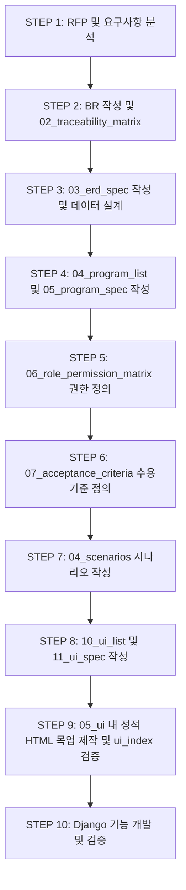
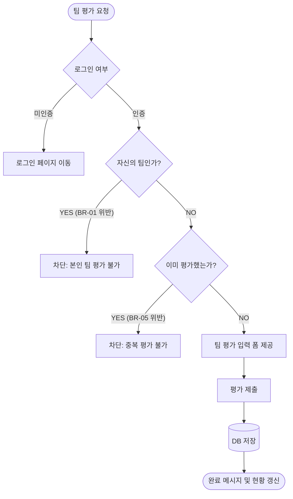

# AX 평가 시스템 분석·설계 산출물 통합 가이드

> **프로젝트:** AX 평가 시스템 2차 프로젝트  
> **대상:** 시스템 분석·설계 경험이 거의 없는 초보 개발자  
> **기술 스택:** Django + PostgreSQL + Bootstrap CDN + GitHub + AI 기반 Vibe Coding  
> **목표:** 고객 요구사항을 구체화하고, 분석·설계 산출물을 작성한 뒤 실제 개발과 검증 단계까지 하나의 기준으로 연결합니다.  
> **핵심 원칙:** 본 문서는 정답 설계를 제공하는 자료가 아닌 **작성 형식과 진행 절차를 안내하는 가이드**입니다. 각 팀은 실제 고객 요구사항을 바탕으로 AI를 활용해 초안을 작성하고, 팀원이 직접 검토·수정·검증해야 합니다.

---

## 📑 목차
1. [통합가이드 개요 및 목적](#1-통합가이드-개요-및-목적)
2. [실제 Repository 구조 (docs/templates)](#2-실제-repository-구조-docstemplates)
3. [전체 진행 프로세스](#3-전체-진행-프로세스)
4. [단계별 상세 작성 가이드](#4-단계별-상세-작성-가이드)
   - [4.1 요구사항 정의 (01_requirements)](#41-요구사항-정의-01_requirements)
   - [4.2 데이터 및 ERD 설계 (02_data)](#42-데이터-및-erd-설계-02_data)
   - [4.3 프로그램 설계 (03_programs)](#43-프로그램-설계-03_programs)
   - [4.4 시나리오 설계 (04_scenarios)](#44-시나리오-설계-04_scenarios)
   - [4.5 UI 명세 및 정적 목업 (05_ui)](#45-ui-명세-및-정적-목업-05_ui)
5. [AI 활용 원칙 및 질문 가이드](#5-ai-활용-원칙-및-질문-가이드)
6. [최종 제출 전 체크리스트 및 검증 질문](#6-최종-제출-전-체크리스트-및-검증-질문)
7. [이번 프로젝트의 핵심 요약](#7-이번-프로젝트의-핵심-요약)

---

## 1. 통합가이드 개요 및 목적

프로젝트 진행 시 산출물이 파편화되는 문제를 방지하기 위해 **요구사항부터 테스트까지 단일 흐름**으로 연결합니다.


```

[고객 요구사항]
│
▼
[BR 번호] ──────► [요구사항 추적표]
│
▼
[데이터 / ERD]
│
▼
[프로그램 목록 / 명세 / 권한]
│
▼
[시나리오 설계]
│
▼
[UI 명세 / HTML 목업]
│
▼
[Django 개발 및 검증]

```

> 🔑 **핵심 키워드:** 요구사항 → 설계 → 개발 → 테스트가 **하나의 BR 번호로 연결**되어야 합니다.

---

## 2. 실제 Repository 구조 (docs/templates)

현재 프로젝트의 실제 `docs/templates/` 디렉터리 구조입니다.


```

docs/
└── templates/
├── 01_requirements/
│   ├── 01_business_rule_example_BR01.md
│   └── 02_traceability_matrix_template.md
│
├── 02_data/
│   └── 03_erd_spec_template.md
│
├── 03_programs/
│   ├── 04_program_list_template.md
│   ├── 05_program_spec_template.md
│   ├── 06_role_permission_matrix_template.md
│   └── 07_acceptance_criteria_template.md
│
├── 04_scenarios/
│   └── (시나리오 관련 템플릿)
│
└── 05_ui/
├── common/
├── 10_ui_list_template.md
├── 11_ui_spec_template.md
├── account_find.html
├── admin_dashboard.html
├── admin_evaluation_questions.html
├── admin_evaluation_round.html
├── admin_result_management.html
├── admin_student_management.html
├── admin_teacher_evaluation.html
├── admin_team_management.html
├── individual_eval.html
├── login.html
├── my_team.html
├── report.html
├── student_home.html
├── team_eval_list.html
└── ui_index.html

```

---

## 3. 전체 진행 프로세스



---

## 4. 단계별 상세 작성 가이드

### 4.1 요구사항 정의 (01_requirements)

비즈니스 규칙(BR)은 시스템의 모든 제약조건과 처리 기준을 포함하며, 추적표(`02_traceability_matrix_template.md`)로 관리합니다.

#### 📄 `01_business_rule_example_BR01.md` 활용 예시

# 비즈니스 규칙(BR)

## BR 번호

BR-01

## 요구사항명

자신의 팀 평가 금지

## 사용자

학생

## 요구사항 설명

학생은 현재 평가 회차에서 본인이 속한 팀을 제외한 다른 팀만 평가할 수 있어야 합니다.

## 정상 상황

학생 A가 Team 1 소속 -> Team 2 선택 -> 평가 문항 입력 -> 제출 성공

## 금지/예외 상황

학생 A가 Team 1 소속 -> Team 1 평가 URL 직접 접근 -> 서버 단에서 평가 차단

## 시스템이 반드시 해야 할 처리

* [ ] 로그인된 사용자의 정보 및 소속 팀 확인
* [ ] 현재 진행 중인 평가 회차 조회
* [ ] 평가 대상 목록에서 본인 팀 자동 제외
* [ ] URL 직접 접근 시 서버 단 2차 검증 및 예외 처리

---

### 4.2 데이터 및 ERD 설계 (02_data)

#### 📄 ERD 검증 체크리스트 (`03_erd_spec_template.md`)

* 모든 평가 데이터가 **평가 회차**와 올바르게 매핑되었는가?
* 학생의 **회차별 팀 소속 정보**가 이력으로 파악 가능한가?
* **팀 평가**와 **개인 평가**의 대상/평가자 관계가 명확히 구분되어 있는가?
* `평가회차 + 평가자 + 평가대상` 조합에 유일성(Unique) 제약이 걸려 중복 평가를 차단하는가?

---

### 4.3 프로그램 설계 (03_programs)

#### 📄 권한 매트릭스 (`06_role_permission_matrix_template.md`)

| 프로그램 ID | 프로그램명 | 학생 | 관리자 | 비로그인 | 관련 BR |
| --- | --- | --- | --- | --- | --- |
| PG-01 | 학생 홈 / 평가 현황 | O | O | X | BR-05 |
| PG-02 | 팀 평가 대상 목록 | O | 필요 시 | X | BR-01, BR-05 |
| PG-03 | 팀 평가 입력 | O | X | X | BR-01, BR-05 |

---

### 4.4 시나리오 설계 (04_scenarios)

#### 📄 흐름 예시 (Mermaid)



---

### 4.5 UI 명세 및 정적 목업 (05_ui)

`05_ui` 디렉터리 안의 정적 HTML 파일들(`student_home.html`, `team_eval_list.html`, `admin_dashboard.html` 등)은 `ui_index.html`을 통해 모두 상호 연결되어야 합니다.

#### 💡 UI 작성 규칙

1. **`10_ui_list_template.md` & `11_ui_spec_template.md` 작성**: 화면별 구성 요소 및 이벤트 정의
2. **`ui_index.html` 중심 연결**: 모든 HTML 목업 파일은 `ui_index.html`에서 클릭만으로 접근할 수 있도록 링크 구성
3. **상단 주석 포함**: 각 HTML 파일 최상단에 관련 BR 번호, UI ID 기재

---

## 5. AI 활용 원칙 및 질문 가이드

> ⚠️ **경고**: "전체 코드 만들어줘" 방식의 프롬프트는 품질 저하와 오류를 유발합니다. 반드시 **단계별(Step-by-step)**로 AI에게 요청하고 결과를 사람이 직접 검증하세요.

### 💡 권장 AI 프롬프트 예시

* **비즈니스 로직 분석:** > "BR-01(본인 팀 평가 금지) 조건이 주어졌을 때, 발생할 수 있는 정상 시나리오 1개와 예외 시나리오 2개를 사용자 행동과 시스템 처리 단계로 구분해 작성해 주세요."
* **ERD 설계 조언:** > "`TeamEvaluation` 모델에서 중복 평가를 방지하기 위한 Django `unique_together` 설정 방안을 제안해 주세요."

---

## 6. 최종 제출 전 체크리스트 및 검증 질문

### 📋 제출 전 체크리스트

* [ ] 모든 요구사항에 **BR 번호**가 할당되고 `02_traceability_matrix`에 기록되었는가?
* [ ] `03_erd_spec`에 평가 회차 및 중복 평가 방지 제약이 반영되어 있는가?
* [ ] `05_ui` 내 정적 HTML 목업이 `ui_index.html`을 통해 에러 없이 모두 연결되는가?
* [ ] `07_acceptance_criteria`의 수용 기준을 만족하도록 설계되었는가?

### ❓ 핵심 검증 질문 (팀원 전원 답변 가능해야 함)

1. "이 기능은 어떤 BR 번호에서 유래되었는가?"
2. "해당 BR을 검증하기 위해 DB 레벨에서 어떤 Unique/FK 제약조건을 사용했는가?"
3. "화면에서 버튼을 숨기는 것 외에, URL 직접 접근 시 서버 단에서는 BR을 어떻게 보장하는가?"

---

## 7. 이번 프로젝트의 핵심 요약

이번 중간 산출물의 목적은 문서를 많이 만드는 것이 아닙니다.

가장 중요한 것은 다음 흐름의 **완벽한 연결**입니다.

> 고객 요구사항을 정확하게 이해하고
> ➔ BR로 정리하고
> ➔ 데이터와 ERD(`03_erd_spec`)를 설계하고
> ➔ 프로그램(`04_program_list`, `05_program_spec`)을 정의하고
> ➔ 정상/예외 시나리오를 작성하고
> ➔ UI(`10_ui_list`, `11_ui_spec`)를 설계하고
> ➔ HTML 목업(`05_ui/*.html`)을 연결하고
> ➔ 개발 후 같은 BR 기준 및 수용조건(`07_acceptance_criteria`)으로 검증하는 것
