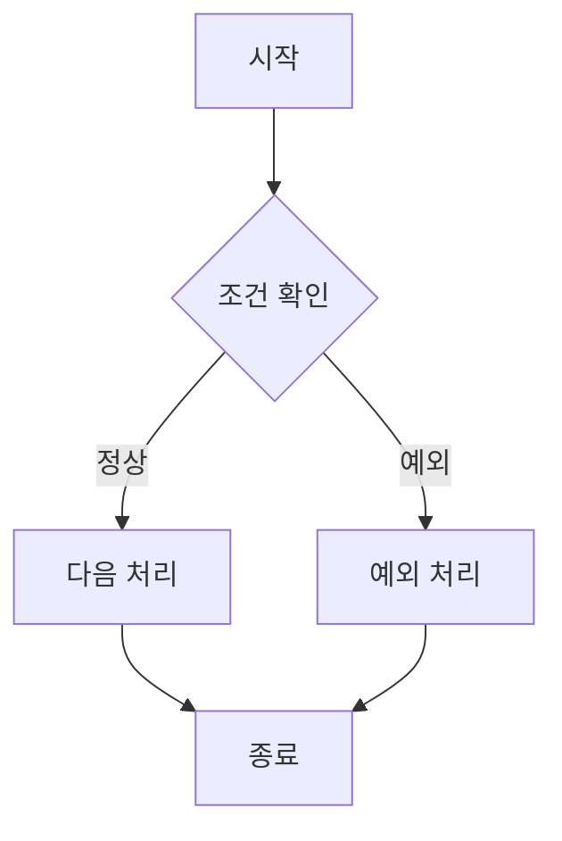

# 업무 흐름 다이어그램

## 관련 Scenario

- SC-

## 관련 BR

- BR-

## Mermaid Flowchart



## AI 생성 프롬프트 예시

```text
아래 상세 시나리오를 기준으로 Mermaid flowchart를 작성해 주세요.

[시나리오]

조건:
1. 사용자 행동과 시스템 판단 구분
2. BR 판단 지점 표시
3. 정상/예외 흐름 구분
4. 구현 코드는 작성하지 않음
```

## 검증

- [ ] 상세 시나리오와 흐름이 일치한다.
- [ ] 관련 BR 판단 지점이 표시되어 있다.
